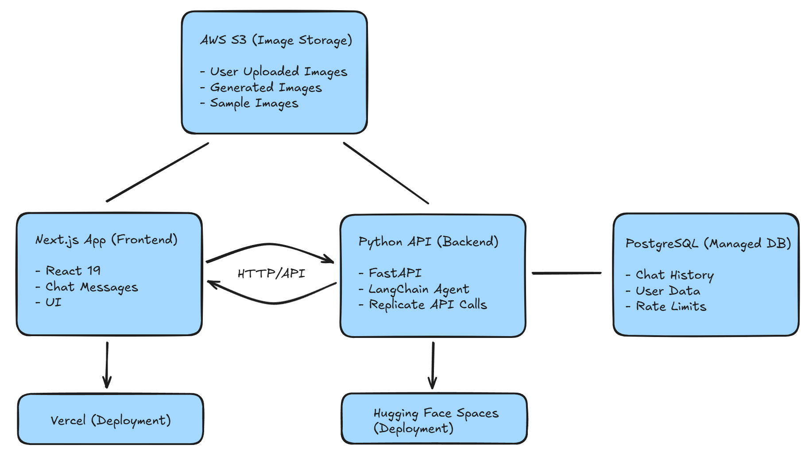

# 🎨 AI Image Editor

A sophisticated AI-powered image editing platform that combines conversational AI with advanced image generation capabilities. Transform your images through natural language interactions with an intelligent assistant.

## 🌟 Overview

AI Image Editor is a full-stack application consisting of a modern Next.js frontend and a powerful Python FastAPI backend. The frontend provides an intuitive chat interface for image editing, while the backend handles AI processing, image generation, and intelligent prompt refinement.

**Live Demo**: [img-edit-agent-flax.vercel.app/](https://img-edit-agent-flax.vercel.app/) 🚀

> ⚠️ **Note**: The agent might take time to boot up if unused for an extended period of time.

## 💡 Motivation

I created this project with a clear and simple motivation: to build a genuinely easy-to-use, high-quality AI image editor that puts convenience first. Existing tools like ChatGPT or Gemini are powerful, but they are primarily designed for conversations rather than image editing. My goal was to focus entirely on the editing experience — prioritizing simplicity, a smooth user flow, and removing unnecessary complexity. This project is my attempt to make AI-driven image editing more accessible, direct, and enjoyable.

## ✨ Key Features

### 🖼️ **Intelligent Image Editing**

- **Conversational Interface**: Chat with Pablo, your AI assistant, to describe image edits in natural language
- **Multi-Image Support**: Select and reference multiple images for complex editing tasks
- **Smart Prompt Refinement**: AI automatically enhances your prompts for better results
- **Real-time Generation**: Get instant feedback and generated images during conversations

### 📱 **Modern Frontend (Next.js)**

- **Responsive Design**: Beautiful, adaptive interface with glassmorphism effects that works seamlessly on both desktop and mobile
- **Image Gallery**: Upload, organize, and manage your image collection
- **Drag & Drop Upload**: Seamless image upload with AWS S3 integration
- **Real-time Chat**: Interactive chat interface with markdown support
- **Sample Images**: Curated collection of example images to get started
- **Auto-scroll Navigation**: Smooth image gallery navigation with arrow controls

### 🧠 **AI-Powered Backend (Python FastAPI)**

- **LLM Integration**: Advanced language model for understanding and processing requests
- **Image Generation**: Powered by Replicate's state-of-the-art models
- **Prompt Engineering**: Sophisticated prompt optimization and enhancement techniques
- **PostgreSQL Managed Database**: Robust connection management with Neon optimization
- **Rate Limiting**: Built-in usage controls and IP-based generation limits
- **Connection Management**: Automatic reconnection and health monitoring for database
- **Health Monitoring**: Comprehensive health checks and status reporting
- **Modular Architecture**: Clean separation of concerns with dedicated LLM tools

### 🚀 **Production-Ready Infrastructure**

- **Auto-Deployment**: CI/CD pipelines for both frontend and backend
- **Cloud Storage**: AWS S3 integration for secure image storage
- **Scalable Architecture**: Designed for high availability and performance
- **Environment Management**: Proper configuration for development and production

## 🏗️ Architecture



### 🔄 **Data Flow:**

1. **User uploads image** → Next.js → AWS S3 (direct upload)
2. **User sends chat message** → Next.js → Python API → PostgreSQL
3. **AI processes request** → Python API → LangChain Agent → Replicate API Call → AWS S3
4. **Image displayed** → Next.js → AWS S3 (direct download)
5. **Chat response** → Python API → Next.js (with image URL)

## 📁 Project Structure

```
img-edit-agent/
├── src/                   # Next.js Frontend Application
│   ├── app/               # App Router pages and layouts
│   ├── lib/               # Server actions and utilities
│   ├── ui/                # Reusable UI components
│   └── types.ts           # TypeScript type definitions
├── api/                   # Python FastAPI Backend
│   ├── server/            # FastAPI application
│   ├── llm/               # LLM agent and tools
│   ├── tests/             # Comprehensive test suite
│   └── Dockerfile         # Container configuration
├── public/                # Static assets
├── .github/workflows/     # CI/CD pipelines
└── README.md              # This file
```

## 🚀 Quick Start

### Prerequisites

- **Node.js 20+** and **pnpm** (for frontend)
- **Python 3.12+** (for backend)
- **AWS S3** bucket (for image storage)
- **Replicate API** key (for image generation)
- **PostgreSQL database** (Neon recommended for free tier)

### Frontend Setup (Next.js)

```bash
# Install dependencies
pnpm install

# Start development server
pnpm dev
```

The frontend will be available at `http://localhost:3000`

### Backend Setup (Python API)

```bash
# Navigate to API directory
cd api

# Install dependencies
pip install -e .[dev]

# Start the API server
uvicorn server.main:app --host 0.0.0.0 --port 8000
```

The API will be available at `http://localhost:8000`

### Environment Configuration

1. For the Next.js app, create `.env` in the root directory following the example from `.env.example`:

   ```env
   HF_API_URL=YOUR_HF_API_URL
   AWS_REGION=us-east-1
   AWS_ACCESS_KEY_ID=your_access_key_here
   AWS_SECRET_ACCESS_KEY=your_secret_key_here
   AWS_S3_BUCKET_NAME=your-bucket-name-here
   ```

2. For the Python API, create `.env` in the `api` directory following the example from `api/.env.example`:

   ```env
   REPLICATE_API_TOKEN=YOUR_REPLICATE_API_TOKEN
   GOOGLE_API_KEY=YOUR_GOOGLE_API_KEY
   DATABASE_URL=YOUR_DATABASE_URL

   AWS_REGION=us-east-1
   AWS_ACCESS_KEY_ID=your_access_key_here
   AWS_SECRET_ACCESS_KEY=your_secret_key_here
   AWS_S3_BUCKET_NAME=your-bucket-name-here
   ```

## 🛠️ Development

### Frontend Development

```bash
# Run tests
pnpm test

# Lint code
pnpm lint

# Build for production
pnpm build
```

### Backend Development

```bash
cd api

# Run tests
python -m pytest tests/ -v

# Run tests with database
python -m pytest tests/ -v -m 'database'

# Run all tests
python -m pytest tests/ -v -m 'not database'
```

## 🚀 Deployment

### Frontend Deployment (Vercel)

The Next.js application is automatically deployed to Vercel via GitHub Actions:

- **Trigger**: Push to `main` branch with changes to `src/` directory
- **URL**: [img-edit-agent-flax.vercel.app/](https://img-edit-agent-flax.vercel.app/)
- **Features**: Automatic builds, preview deployments, and analytics

### Backend Deployment (Hugging Face Spaces)

The Python API is deployed to Hugging Face Spaces using Docker automatically via GitHub Actions:

- **Trigger**: Push to `main` branch with changes to `api/` directory
- **URL**: [huggingface.co/spaces/codinglabsong/img-edit-agent-api](https://huggingface.co/spaces/codinglabsong/img-edit-agent-api)
- **Features**: Containerized deployment, automatic scaling, and health monitoring

See [`DEPLOYMENT.md`](DEPLOYMENT.md) for detailed deployment instructions.

## 🔧 API Reference

### Chat Endpoint

**POST** `/chat`

Send a message to the AI assistant with optional image references.

```json
{
  "message": "Make this image more vibrant and colorful",
  "selected_images": [
    {
      "id": "image_123",
      "url": "https://...",
      "title": "My Photo",
      "description": "A beautiful landscape"
    }
  ],
  "user_id": "user_456"
}
```

**Response:**

```json
{
  "response": "I'll enhance the vibrancy and colors in your image...",
  "status": "success",
  "generated_image": {
    "id": "gen_789",
    "url": "https://...",
    "title": "Enhanced Image",
    "description": "Vibrant and colorful version"
  }
}
```

### Health Check

**GET** `/health`

Returns the API status and database connectivity.

## 🧪 Testing

### Frontend Tests

- **Unit Tests**: Component testing with Vitest
- **Integration Tests**: API integration testing
- **E2E Tests**: User workflow testing

### Backend Tests

- **API Tests**: Endpoint testing with pytest
- **LLM Tests**: Agent and tool testing
- **Database Tests**: Data persistence testing

## 🛡️ Security & Performance

- **Rate Limiting**: IP-based generation limits (10 images/week)
- **Input Validation**: Comprehensive request validation
- **Error Handling**: Graceful error handling and fallbacks
- **CORS Configuration**: Secure cross-origin requests
- **Environment Variables**: Secure configuration management

## 🤝 Contributing

1. Fork the repository
2. Create a feature branch (`git checkout -b feature/amazing-feature`)
3. Commit your changes (`git commit -m 'Add amazing feature'`)
4. Push to the branch (`git push origin feature/amazing-feature`)
5. Open a Pull Request

## 📄 License

This project is licensed under a custom Non-Commercial MIT-Style License - see the [LICENSE](LICENSE) file for details.

## 🙏 Acknowledgments

- **Replicate** for powerful image generation models
- **Hugging Face** for hosting infrastructure
- **Vercel** for frontend deployment
- **AWS** for cloud storage services

---

**Built with ❤️ using Next.js, FastAPI, and AI**
